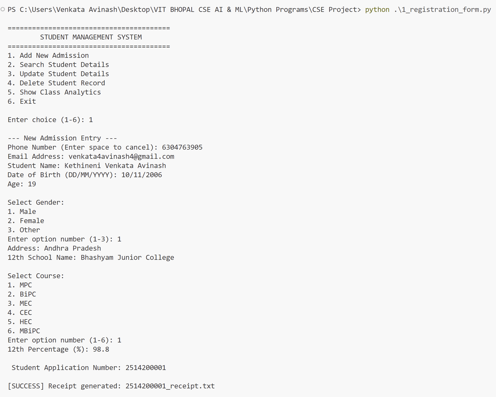
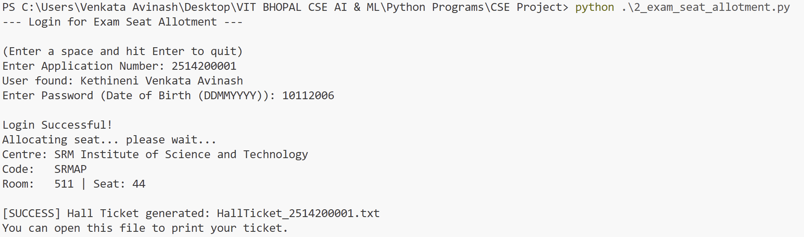
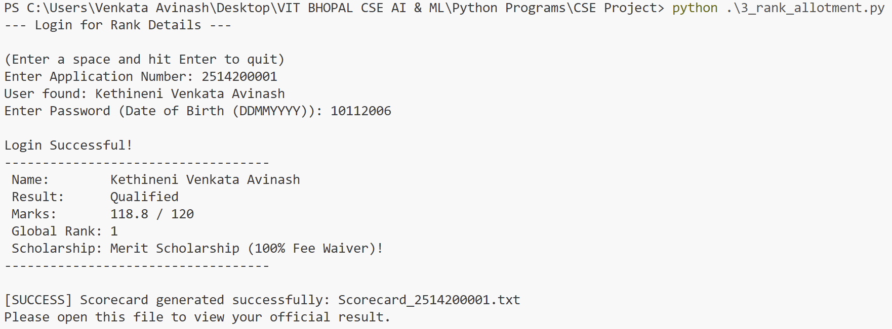
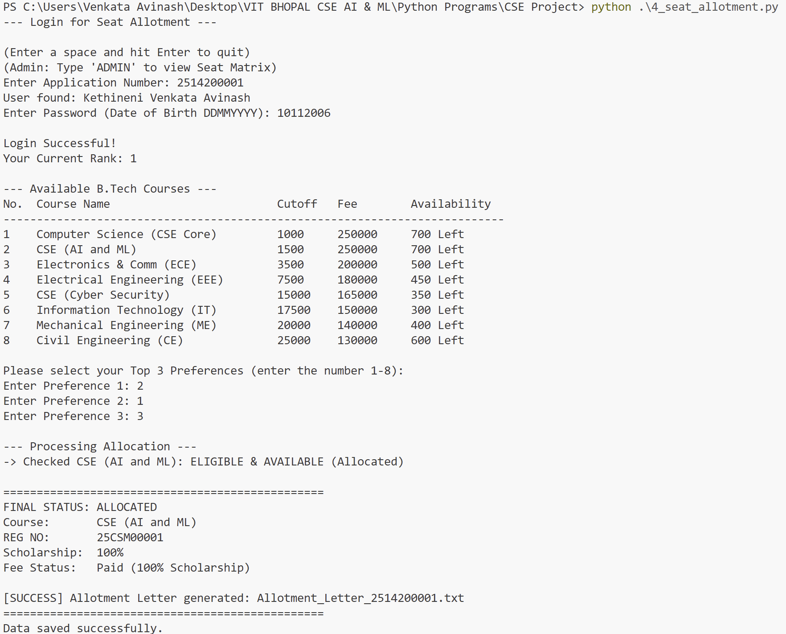
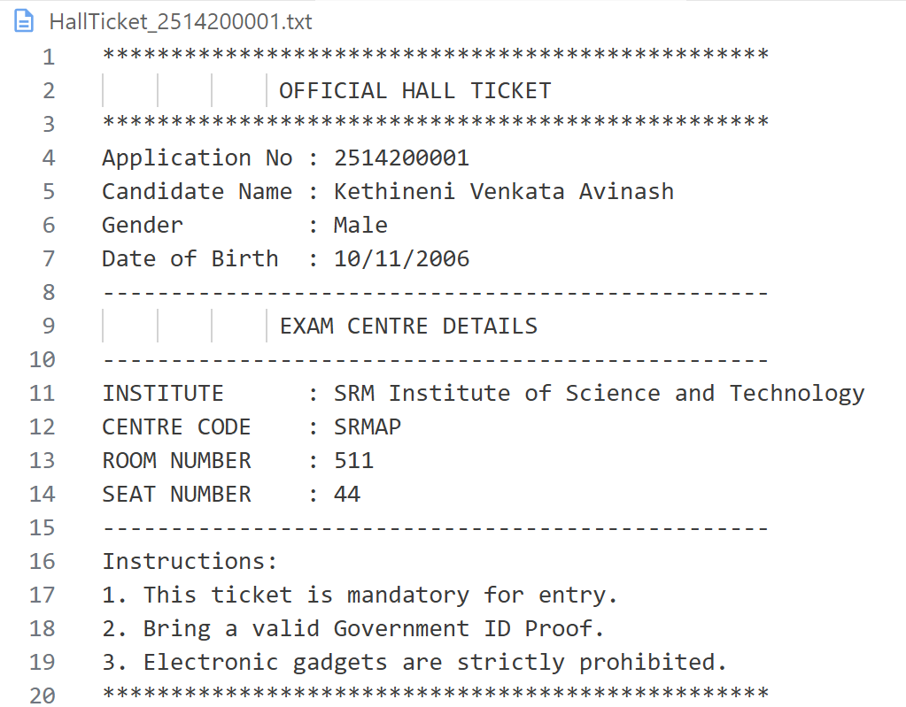
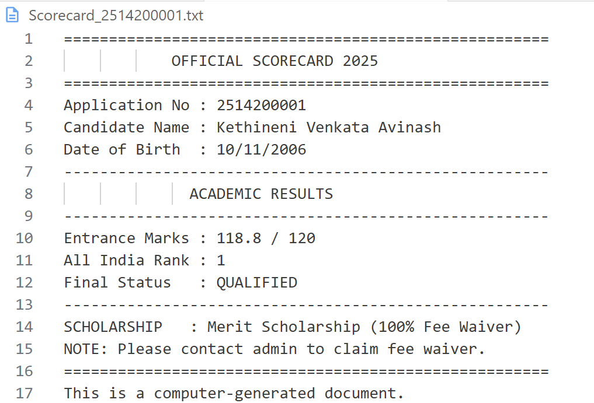
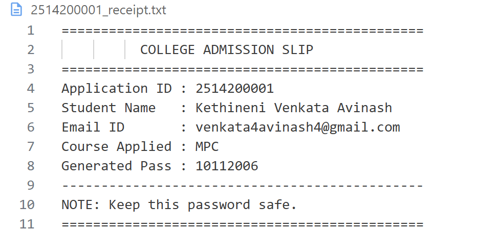

End-to-End Student Admission & Counselling System

Project Title: Automated Student Admission & Counselling Management System

Overview
This project is a comprehensive, Python-based console application designed to simulate and automate the entire lifecycle of a university admission process. Unlike simple data entry systems, this project implements complex logic to handle the workflow from the initial Student Registration to Logistics (Exam Seat Allocation), Analytics (Ranking & Scoring), and finally Counselling (Branch Seat Allotment).
The system utilizes a centralized CSV file as a database to ensure data persistence across different modules and generates official text-based documents (Hall Tickets, Allotment Letters) as proof of record.
Features
1. Robust Registration Module
•	Data Validation: Enforces strict age limits (16-25 years), validates email formats, and prevents duplicate phone number registrations.
•	Security: Implements SHA-256 Hashing to store passwords securely in the database; no plain text passwords are stored.
2. Conflict-Free Exam Logistics
•	Randomized Allocation: Assigns Exam Centres, Room Numbers, and Seat Numbers randomly.
•	Collision Detection: Uses a set-based algorithm to ensure no two students are assigned the same seat in the same centre.
3. Logic-Based Ranking System
•	Merit Calculation: Automatically calculates entrance scores based on academic history.
•	Multi-Key Sorting: Implements a tie-breaker algorithm that ranks students by Marks (Descending) and then by Date of Birth (Ascending), giving preference to older candidates in case of a tie.
4. Dynamic Counselling & Seat Allotment
•	Live Seat Matrix: Displays real-time seat availability for B.Tech branches (CSE, ECE, EEE, etc.).
•	Rank-Based Access: Restricts course selection if the student's rank does not meet the required cutoff.
•	Greedy Allocation: Automatically assigns the student's highest preferred course based on vacancy.
5. Automated Document Generation
The system automatically generates downloadable .txt files at every stage:
•	 Registration_Slip.txt
•	 HallTicket.txt
•	 Scorecard.txt
•	 Allotment_Letter.txt
 Technologies & Tools Used
•	Programming Language: Python 3.x
•	Data Storage: CSV (Comma Separated Values) Flat File System
•	Standard Libraries:
o	csv: For CRUD operations on the database.
o	hashlib: For password encryption.
o	datetime: For age validation and timestamping.
o	random: For generating unique seat allocations.
o	os: For file path handling and validation.
Steps to Install & Run
Prerequisites
•	Ensure Python 3.10 or higher is installed on your system.
•	No external pip packages are required (uses standard library).
Installation
1.	Clone the Repository:
git clone https://github.com/KethineniVenkataAvinash/student-admission-system.git
cd student-admission-system
2.	Run the Modules Sequentially: The system follows a strict timeline. You must run the files in the following order:
Step 1: Registration
o	Run: python 1_registration_form.py
o	Action: Register a new student. This initializes the data_store.csv database. Note down the generated Application Number.
Step 2: Exam Logistics
o	Run: python 2_exam_seat_allotment.py
o	Action: Login with App ID and Password (DOB). The system will assign an exam center and generate a Hall Ticket.
Step 3: Ranking & Results
o	Run: python 3_rank_allotment.py
o	Action: (Admin Step) This script processes all students, calculates ranks, and generates Scorecards.
Step 4: Counselling
o	Run: python 4_seat_allotment.py
o	Action: Login to view the Seat Matrix. Enter your top 3 branch preferences. The system will allot a seat based on your Rank and Vacancy.
Instructions for Testing
To verify the system works as expected, try these test scenarios:
1.	Test Age Validation:
o	During registration, try entering a Date of Birth that makes the student 15 years old (e.g., current year - 15).
o	Expected Result: System should reject the entry with an error message.
2.	Test Password Hashing:
o	After registering, open the data_store.csv file in Excel or Notepad.
o	Expected Result: Look at the Password_Hash column. It should contain a long string of random characters (the hash), not the actual date of birth.
3.	Test Tie-Breaker Logic:
o	Register two students with the same 12th Percentage but different Dates of Birth.
o	Run the ranking module (3_rank_allotment.py).
o	Expected Result: The older student (earlier DOB) should have a better (lower) Rank than the younger student.
4.	Test Seat Cutoffs:
o	In the Counselling module (4_seat_allotment.py), try to choose "CSE" (Computer Science) if your rank is very high (e.g., 5000) and the cutoff is 1000.
o	Expected Result: The system should print "Not Eligible (Rank > Cutoff)" and check your next preference.

## 🏗️ System Architecture & Design

### System Architecture

### Database Design
| ER Diagram | Schema Design |
| :---: | :---: |
|  |  |

### Process Flow

### Sequence & Component Diagrams
| Sequence Diagram | Component Diagram |
| :---: | :---: |
|  |  |

### Class Diagram

## 📸 Project Outputs

### 1. Registration

### 2. Exam Logistics

### 3. Rank Generation

### 4. Counseling & Allotment

---

## 📄 Generated Documents

| Hall Ticket | Allotment Letter |
| :---: | :---: |
|  |  |

| Scorecard | Receipt |
| :---: | :---: |
|  |  |

Project Structure
Plaintext
├── 1_registration_form.py    # Main Entry: Student Data Collection
├── 2_exam_seat_allotment.py  # Logistics: Center & Seat Assignment
├── 3_rank_allotment.py       # Analytics: Scoring & Global Ranking
├── 4_seat_allotment.py       # Final Stage: Counseling & Branch Selection
├── utils.py                  # Shared Helper Functions & Constants
├── allotment_letter.py       # Doc Generator: Allotment Letter
├── hall_ticket.py            # Doc Generator: Hall Ticket
├── registration_slip.py      # Doc Generator: Receipt
├── scorecard_generator.py    # Doc Generator: Result Card
├── data_store.csv            # Central Database (Auto-generated)
└── README.md                 # Project Documentation
 License
This project is open-source and available under the MIT License.

